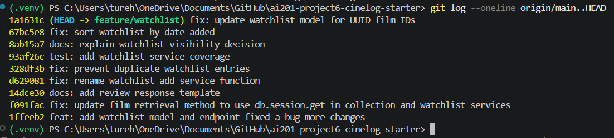

# PR Response Doc � CineLog Watchlist Feature

## AI Usage

I used AI as a support tool for codebase orientation, debugging workflow, and commit-history review. I verified all code changes against the actual CineLog files and test results instead of relying on AI output alone.

## Comment 1 — Rename

**What I did:**

I renamed `save_to_watchlist()` to `add_to_watchlist()` in `services/watchlist_service.py` so the watchlist service follows the same `verb_to_noun` naming convention used elsewhere in the project, such as `add_to_collection()` in `services/collection_service.py`.

I also updated the watchlist route in `routes/watchlist/watchlist.py` so it imports and calls `add_to_watchlist()` instead of the old function name.

**How I verified:**

I searched the watchlist service and route files to confirm there were no remaining references to `save_to_watchlist`. I also ran `pytest tests/ -v` and confirmed the existing test suite still passed.

## Comment 2 — Deduplication

**What I did:**

I added deduplication logic to `add_to_watchlist()` in `services/watchlist_service.py`. The function now checks whether a `WatchlistEntry` already exists for the same `user_id` and `film_id` before creating a new row. If a duplicate exists, it raises a new `AlreadyInWatchlistError`.

I followed the same pattern used by `add_to_collection()` in `services/collection_service.py`, which checks for an existing `CollectionEntry` and raises `AlreadyInCollectionError` before inserting a duplicate.

**How I verified:**

I ran `python -m py_compile services\watchlist_service.py` to confirm the file had no syntax errors. I also ran `pytest tests/ -v` to confirm the existing test suite still passed. In addition, I manually tested the service by adding the same film to the same user's watchlist twice and confirmed the second call raised `AlreadyInWatchlistError` and only one database row existed.

## Comment 3 — Missing test

**What I did:**

I created a new file, `tests/test_watchlist.py`, for watchlist service tests. I added `test_add_to_watchlist_nonexistent_film_raises`, which verifies that calling `add_to_watchlist()` with a film ID that does not exist raises `FilmNotFoundError`.

I followed the same fixture and assertion pattern used in `tests/test_collection.py`, especially `test_add_to_collection_nonexistent_film_raises`.

I also added `test_add_to_watchlist_duplicate_raises` to cover the deduplication behavior from Comment 2. This test verifies that adding the same film twice raises `AlreadyInWatchlistError` and that only one `WatchlistEntry` exists in the database.

**How I verified:**

I ran `python -m py_compile tests\test_watchlist.py` to confirm the test file had no syntax or encoding errors. I then ran `pytest tests/test_watchlist.py -v` and confirmed both watchlist tests passed. Finally, I ran `pytest tests/ -v` and confirmed the full test suite passed with 6 tests.

## Comment 4 — Default visibility

**My position:**

I chose to keep `public=True` as the default for watchlist entries.

**Reasoning:**

CineLog is described as a community film tracking app, so I think the watchlist feature should support social discovery by default. A public watchlist lets other users see what someone is interested in watching, which fits the same community-oriented purpose as sharing film activity, collections, and recommendations.

I also think this default keeps the first version of the endpoint simple. The current `POST /watchlist/<user_id>/add` request only accepts a `film_id`, so the model default gives the feature a clear behavior without requiring the caller to pass extra visibility data before the app has a dedicated privacy UI.

**Tradeoff acknowledged:**

The tradeoff is privacy. Some users may expect a watchlist to be personal, especially if it reflects films they are curious about but have not watched yet. A private default would be safer from a privacy-first perspective. For this version, I think the community/discovery use case supports `public=True`, but a future improvement would be to add an explicit visibility parameter so callers can choose whether each watchlist entry is public or private.

## Comment 5 — Sort order

**My position:**

I agreed with the maintainer and changed the watchlist default sort order from alphabetical title order to date-added order, newest first.

**Reasoning:**

A watchlist is closer to a saved queue than a catalog browsing page. When a user adds a film to their watchlist, the most recently added item is usually the most relevant one to show first. This also matches the existing collection behavior in `get_collection()`, which returns films by `date_added` descending.

Alphabetical order can be useful for scanning a long list, but it hides the user's most recent action. For the default API behavior, newest-first is a better fit because it reflects how users usually return to a saved list: they often want to see what they just added.

**Engagement with reviewer's point:**

The maintainer's point is reasonable because the API should optimize for the most common user behavior. Since CineLog already uses newest-first ordering for collections, updating the watchlist to use `WatchlistEntry.date_added.desc()` also makes the watchlist more consistent with the rest of the codebase.

## Comment 6 — Rebase

**What conflicted:**

The rebase conflicted with the film ID refactor that had merged into `main`. The feature branch originally used integer film IDs in the watchlist code, while updated `main` migrated film IDs to UUID strings. During the rebase, I also had to resolve the `.gitignore` conflict because both my branch and `main` had added one.

**How I resolved it:**

I rebased `feature/watchlist` on top of updated `main` and kept the UUID-based version of the film model. I restored the `WatchlistEntry` model after the rebase and updated its `film_id` field to use `db.String(36)` so it matches the UUID type used by `Film.id`. I also kept the watchlist relationship to `Film`, kept the `public=True` default, and added a unique constraint on `user_id` and `film_id` to support the deduplication behavior.

I also updated the watchlist service and route comments so `film_id` is described as a UUID instead of an integer.

**How I verified no conflict remains:**

I ran `python -m py_compile models.py services\watchlist_service.py routes\watchlist\watchlist.py` to confirm the changed files compile. I ran `pytest tests/ -v` and confirmed the full test suite passed. I also ran `git log --oneline --merges origin/main..HEAD` and confirmed there were no merge commits on the feature branch.

## PR Description

This PR adds a watchlist feature to CineLog so users can save films they want to watch later. It includes a `WatchlistEntry` model, watchlist service functions, and REST endpoints for viewing a user's watchlist and adding a film to the watchlist.

During review, I addressed the maintainer's requested changes. I renamed the service function from `save_to_watchlist()` to `add_to_watchlist()` to match the project's `verb_to_noun` naming convention. I added deduplication logic so the same user cannot add the same film to their watchlist more than once. I also added watchlist service tests for nonexistent film IDs and duplicate watchlist entries.

For default visibility, I chose to keep `public=True` because CineLog is a community film tracking app and public watchlists support discovery and recommendations. I acknowledged the privacy tradeoff and documented that a future improvement would be adding an explicit visibility parameter. For sort order, I agreed with the maintainer and changed the watchlist default ordering to `date_added` descending so users see their most recently saved films first.

I also rebased the branch on the updated `main` branch after the film ID refactor. I updated the watchlist model so `film_id` uses UUID strings consistently with `Film.id`.

Manual testing steps:
1. Run `python -m venv .venv`
2. Activate the virtual environment with `.\.venv\Scripts\Activate.ps1`
3. Run `pip install -r requirements.txt`
4. Run `pytest tests/ -v`
5. Start the app with `python app.py`
6. Test `GET /watchlist/<user_id>` to view a user's watchlist
7. Test `POST /watchlist/<user_id>/add` with a JSON body like `{ "film_id": "<film_uuid>" }`
8. Try adding the same film twice and confirm the duplicate is rejected by the service logic

## Git Log Screenshot

The screenshot below shows my cleaned `git log --oneline` history on the `feature/watchlist` branch after rebasing on `main`.

